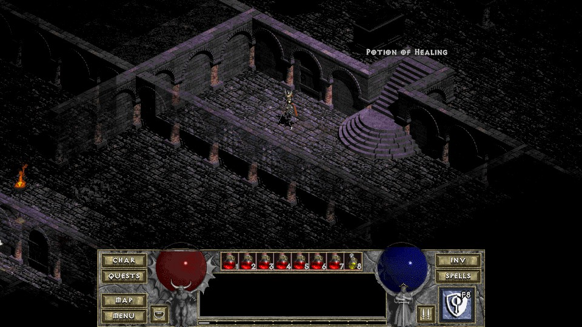

# DevilutionX Randomizer

Randomizes DevilutionX Level Palettes

## Setup

- copy the palette folder, randclear.bat, random.lua and randomize.bat to your DevilutionX folder
- edit randomize bat / randclear.bat and change the "savedir" and "configdir" paths
- execute "randomize.bat"
- for default Diablo palettes execute "randclear.bat"

## LUA randomize stead of BATCH random function

- download LUA (https://github.com/rjpcomputing/luaforwindows/releases) and copy the files to your DevX folder
- execute "lua54.exe random.lua"

## Demo Images

